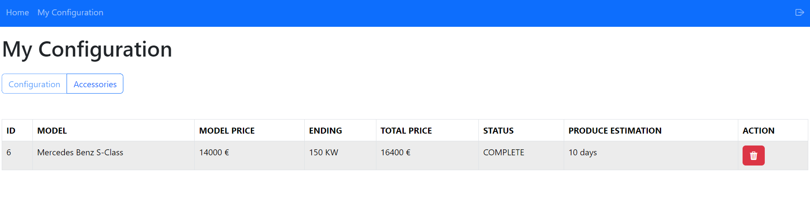

# Exam #2: "Car Configurator"
## Student: s326603 KULLOLLI KLAUS 

## React Client Application Routes

- Route `/login`: page contains login form and proper validation for each field. Used for users login into website.
- Route `/` or `/car`: page contains car list and all available accessories.
- Route `/configuration`: page contains created car configuration of logged user.
- Route `/edit-configuration`: page for adding and removing accessories for logged user's configuration.

## API Server

- POST `/login`
  - request parameters:
    - body:  `{username:'string', 'password': 'string'}`
  - response body content:  `{"id":Number,"username":"string","role":"string"}`

- POST `/login`
  - request parameters:
    - Cookies: `connect.sid="string"`
  - response body content:  `{"message": "string"}`

- GET `/car`
  - request parameters:
  - response body content:   `[{
        "id": Number,
        "model": "string",
        "engine": Number,
        "price": Number,
        "maxAccessories": Number
    }, ... ]` 

- GET `/accessory`
  - request parameters:
  - response body content:   `[
    {
        "id": Number,
        "name": "string",
        "price": Number,
        "amount": Number
    }, ... ]` 

- POST `/auth`
  - request parameters:
    - Cookies: `connect.sid="string"`
  - response body content:  `{"message": "string", "timestamp": "string"}`

- GET `/configuration`
  - request parameters:
    - Cookies: `connect.sid="string"`
  - response body content:  `{
    "id": 3,
    "status": "incomplete",
    "car": {
        "id": Number,
        "model": "string",
        "engine": Number,
        "price": Number,
        "maxAccessories": Number
    },
    "accessories": [
        {
            "id": Number,
            "name": "string",
            "price": Number,
            "amount": Number
        }, ...],
    "totalPrice": Number
}`

- POST `/configuration/car/:carId`
  - request parameters:
    - param: `carId=Number`
    - Cookies: `connect.sid="string"`
  - response body content:  `{
    "id": Number,
    "status": "incomplete",
    "carId": Number,
     "userId": Number}`

- POST `/configuration/check/remove/:id`
  - request parameters:
    - param: `id=Number`
    - body: `{   "accessories": [
        {
            "id": Number,
            "name": "string",
            "price": Number,
            "amount": Number
        }, ...]}`
    - Cookies: `connect.sid="string"`
  - response body content:  `{"message": "string", "timestamp": "string"}`

- POST `/configuration/check/add/:id`
  - request parameters:
    - param: `id=Number`
    - body: `{   "accessories": [
        {
            "id": Number,
            "name": "string",
            "price": Number,
            "amount": Number
        }, ...]}`
    - Cookies: `connect.sid="string"`
  - response body content:  `{"message": "string", "timestamp": "string"}`

- POST `/configuration/save`
  - request parameters:
    - body: `{   "accessories": [
        {
            "id": Number,
            "name": "string",
            "price": Number,
            "amount": Number
        }, ...]}`
    - Cookies: `connect.sid="string"`
  - response body content:  `{"message": "string", "timestamp": "string"}`

- DELETE `/configuration`
  - request parameters:
    - Cookies: `connect.sid="string"`
  - response body content:  `{"message": "string", "timestamp": "string"}`

- POST `/configuration/complete`
  - request parameters:
    - Cookies: `connect.sid="string"`
  - response body content:  `{"message": "string", "timestamp": "string"}`

- GET `/server2-auth`
  - request parameters:
    - Cookies: `connect.sid="string"`
  - response body content:  `{"token": "string", "timestamp": "string"}`

## API Server2

- POST `/estimation`
  - request parameters:
    - Header:  `authorization: 'Bearer token'`
    - body: `{   "accessories": [
        {
            "id": Number,
            "name": "string",
            "price": Number,
            "amount": Number
        }, ...]}`
  - response body content:  `{"accessories": [
        {
            "id": Number,
            "name": "string",
            "price": Number,
            "amount": Number
        }, ...], 
        estimation: Number}`

## Database Tables

- Table `User` - contains `(id, username, role, type, password, salt)`
- Table `Car` - contains `(id, model, engine, price, maxAccessories)`
- Table `Accessory` - contains `(id, name, price, amount)`
- Table `Constrain` - contains `(id, accessoryId, constrainAccessoryId, type)` accessoryId is foreign key with reference Accessory(id), constrainAccessoryId is foreign key with reference Accessory(id)
- Table `Configurations` - contains `(id, userId, carId, status)` userId is foreign key  with reference User(id), carId is foreign key  with reference Car(id)
- Table `ConfigurationAccessory` - contains `(id, configurationId, accessoryId)` configurationId is foreign key  with reference Configurations(id), accessoryId is foreign key  with reference Accessory(id)

## Main React Components
- `Cars` (in `CarsRoute.jsx`): component shows all available cars and accessories where user can choose a car for configuration. 
- `Configuration` (in `ConfigurationRoute.jsx`): component  shows the active(created) configuration for particular logged user. User can edit, delete and confirm completion. If configuration is already completed user can see estimated time to produce the configuration. 
- `EditConfiguration` (in `EditConfigurationRoute.jsx`): component is used to edit created configuration. User can add or remove accessories according to predefined constrains. 
- `Login` (in `LoginRoute.jsx`): component that contains login form and proper input validation.
- `Layout` (in `Layout.jsx`): component that wrap other components and contains Nav to move throw routes.

## Screenshot

## Users Credentials

- user1, user123
- user2, user123
- user3, user123
- user4, user123
- user5, user123

